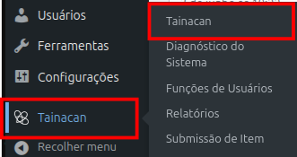
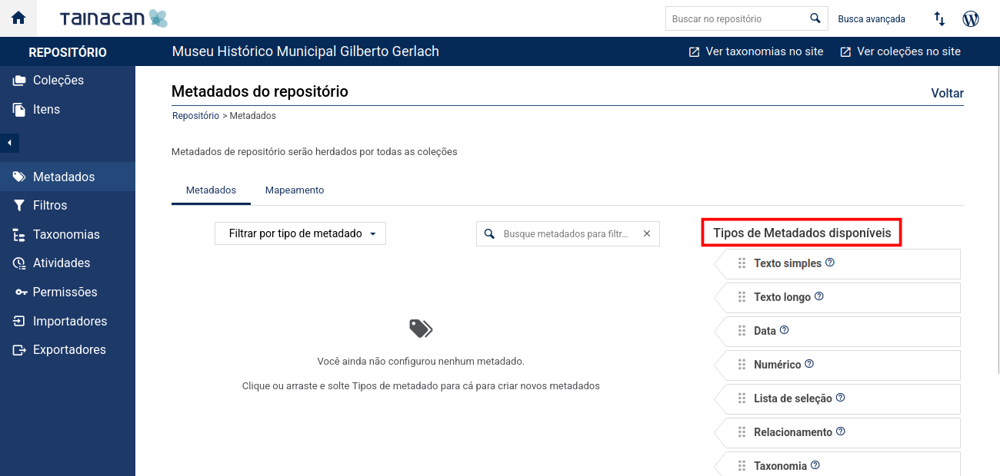
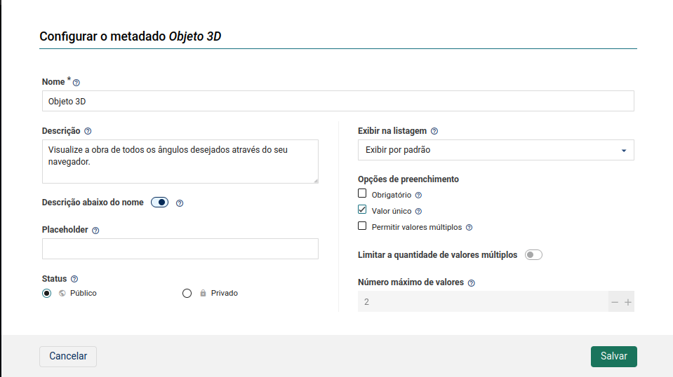

## 4. Inclusão de Objetos 3D no Projeto

Dentro das informações específicas de cada obra cadastrada, há possibilidade de inserção de campo específico para links que direcionam até os objetos 3D das obras. 

Os objetos devem estar disponibilizados na diretório específico para tal, "/opt/lampp/htdocs/objetos3d/<pasta-contendo-objeto>".

As pastas dos objetos devem estar preparadas para sua visualização na internet, utilizando o endereço "<domínio>/objeto3d/<pasta-contendo-objeto>" é possível visualizá-los em tela cheia.

---

### 4.1. Inserindo os Links via Tainacan

Para inserção dos links como campo dentro das informações da obra, é necessário criar um metadado com esse intuito. Através da interface do Tainacan, basta seguir os passos:

1. Selecionar Tainacan na interface do Wordpress e selecionar Tainacan  
   

2. Selecionar Metadados do repositório  
   

3. Selecionar URL  
   

4. Configurar os campos conforme desejado  
   

---

Com o metadado configurado é possível inserir os links para os objetos 3D ao inserir/editar uma obra.

