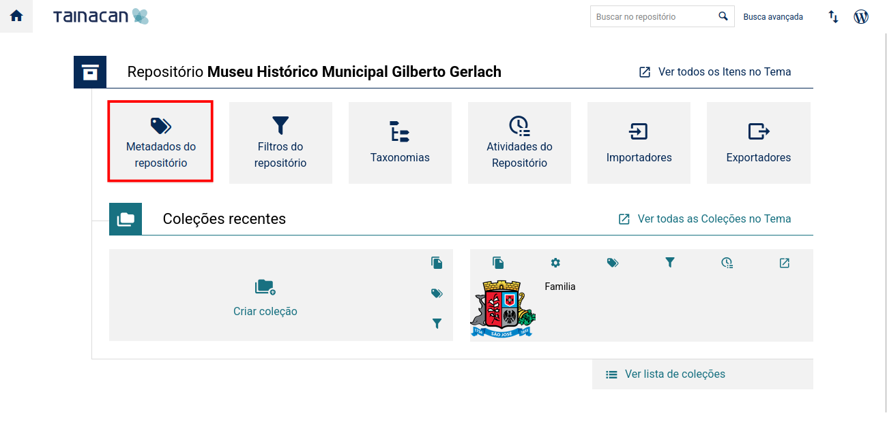

# Documentação do Projeto: Site do Museu de SJ com WordPress e Tainacan

## 1. O que é o WordPress

WordPress é um sistema de gerenciamento de conteúdo (CMS) de código aberto, utilizado para criar, gerenciar e manter sites e blogs. Ele permite que usuários criem websites dinâmicos sem necessidade de conhecimentos avançados em programação.

### 1.1. Principais Características Técnicas

- **Código Aberto**: O WordPress é gratuito e de código aberto, permitindo que qualquer pessoa utilize, modifique e distribua o software.
- **Interface de Administração**: Fornece uma interface amigável para criação de posts, páginas, upload de mídia e ajustes de configurações, sem necessidade de escrever código.
- **Arquitetura Flexível**: Permite a criação de sites simples ou complexos, com suporte a tipos de conteúdo personalizados (Custom Post Types) e taxonomias.
- **Segurança e Atualizações**: O WordPress é atualizado regularmente para aprimorar a segurança e adicionar funcionalidades. Plugins de segurança também estão disponíveis.

### 1.2. Temas e Plugins

- **Temas**: Controlam o design e a aparência do site.
- **Plugins**: Adicionam funcionalidades extras ao WordPress, como galerias, formulários de contato, SEO, entre outros.

---

## 2. O que é o Tainacan

Tainacan é um plugin para WordPress que transforma o CMS em uma plataforma de repositório digital de código aberto. Ele permite que instituições e usuários criem, organizem e publiquem coleções digitais com facilidade e flexibilidade.

### 2.1. Principais Recursos

- **Coleções**: Agrupamentos de itens digitais como fotos, documentos e vídeos.
- **Itens**: Cada item é tratado como um post do WordPress, com campos personalizados (metadados).
- **Metadados**: Informações como autor, data e tipo de material são armazenadas como campos personalizados no banco de dados.
- **Taxonomias**: Classificação dos itens por categorias, temas e outros critérios.

---

## 3. Implementação do Site do Museu de SJ com o Tainacan

### 3.1. Visão Geral

Este projeto consiste na criação do site oficial do Museu de SJ, utilizando o Tainacan como solução para gestão e exibição do acervo digital.

### 3.2. Objetivos

- Disponibilizar um catálogo online acessível e intuitivo.
- Utilizar o Tainacan para gerenciar metadados, coleções e itens.
- Garantir uma experiência responsiva e acessível.
- Integrar com outras ferramentas e serviços do museu.

### 3.3. Tecnologias Utilizadas

- **WordPress** (CMS)
- **Tainacan** (plugin de repositório digital)
- **HTML e CSS** (front-end personalizado)
- **MySQL** (banco de dados)

### 3.4. Funcionalidades Implementadas

#### Catálogo Digital

- Busca avançada e filtros por metadados.
- Visualização detalhada dos itens (imagens, descrição, histórico).

#### Gestão de Coleções

- Organização por categorias, tags e taxonomias.
- Suporte a importação/exportação em CSV, JSON, entre outros formatos.

#### Design e Acessibilidade

- Layout responsivo (desktop, tablet e celular).
- Compatibilidade com as diretrizes de acessibilidade (WCAG).

---

## 4. Inclusão de Objetos 3D no Projeto

Dentro das informações específicas de cada obra cadastrada, há a possibilidade de inserção de um campo para links que direcionam até os objetos 3D.

Os objetos devem estar armazenados em um diretório específico:  
`/opt/lampp/htdocs/objetos3d/<pasta-do-objeto>`

Para visualização, o acesso deve ser feito via URL no seguinte formato:  
`<domínio>/objeto3d/<pasta-do-objeto>`

### 4.1. Inserindo os Links via Tainacan

1. Acesse o menu **Tainacan** no painel do WordPress.  
   

2. Clique em **Metadados do Repositório**.  
   

3. Adicione um metadado do tipo **URL**.  
   

4. Configure os campos conforme necessário.  
   

Após a criação do metadado, os links para os objetos 3D poderão ser inseridos durante a edição ou criação de uma nova obra.

---

## 5. Passo a Passo para Implementação de Tour Virtual no Tainacan

### 5.1. Pré-requisitos

- Tainacan instalado e funcionando.
- Acesso administrativo ao painel WordPress.
- Arquivos do tour virtual prontos (imagens 360°, modelos 3D ou links externos).

---

### 5.2. Método 1: Usando o Plugin WP VR (Recomendado)

#### Passo 1: Instalação do Plugin

1. Vá em `Plugins > Adicionar Novo` no painel WordPress.
2. Pesquise por **WP VR**.
3. Instale e ative o plugin **WP VR - 360° Image Viewer**.

#### Passo 2: Criação do Tour Virtual

1. Vá em `WP VR > Add New Tour`.
2. Faça o upload das imagens 360°.
3. Configure os hotspots e cenas.
4. Publique o tour e copie o shortcode gerado (ex: `[wpvr id="123"]`).

#### Passo 3: Integração com Tainacan

1. Acesse a coleção no Tainacan.
2. Vá em `Metadados > Adicionar Novo`:
   - Nome: **Tour Virtual**
   - Tipo: **Texto HTML**
   - Marque a opção **Exibir como conteúdo do item**
3. Salve o metadado.

#### Passo 4: Adicionar o Tour a um Item

1. Edite ou crie um item.
2. Cole o shortcode do tour virtual no campo correspondente.
3. Salve o item.

---

### 5.3. Método 2: Embed com Iframe (Para Serviços Externos)

#### Passo 1: Obter o Código de Incorporação

1. Acesse o serviço de tour virtual (como Matterport, Kuula etc.).
2. Copie o código iframe na opção de incorporação.

#### Passo 2: Criar Metadado no Tainacan

1. Vá em `Metadados > Adicionar Novo`:
   - Nome: **Tour Virtual Externo**
   - Tipo: **Texto HTML**
   - Marque a opção **Permitir tags HTML**
2. Salve o metadado.

#### Passo 3: Inserir no Item

1. Edite o item desejado.
2. Cole o código iframe no campo criado.
3. Ajuste a largura e altura se necessário (ex: `width="100%" height="500px"`).

---
